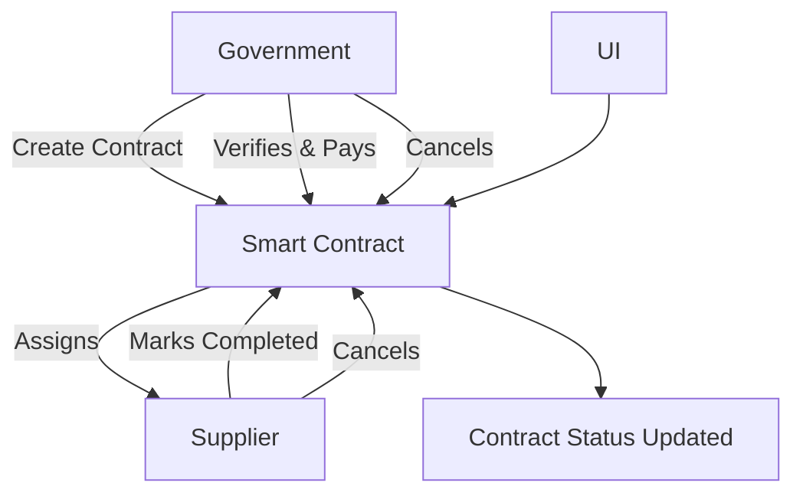

# Government Procurement DApp – A Decentralized Procurement Management System

**Government Procurement DApp** is a decentralized application (DApp) built on Ethereum that enables secure, transparent, and efficient procurement processes. It facilitates contract creation, approval, and payment between government entities and suppliers, ensuring accountability and reducing corruption through blockchain technology.

---

## Table of Contents

1. [Features](#-features)  
2. [Tech Stack](#-tech-stack)  
3. [Project Structure](#-project-structure)  
4. [ System Flowchart](#-system-flowchart)  
5. [Setup & Installation](#-setup--installation)  
6. [ Screenshots (Optional)](#-screenshots)  
7. [ Future Enhancements](#-future-enhancements)  

---

## Features

- **Government Dashboard**: Create procurement contracts and manage statuses.
- **Supplier Portal**: View assigned contracts and mark them as completed.
- **Role-Based Views**: Government sees all contracts; suppliers only see theirs.
- **Lifecycle Actions**:
  - Mark Contract Completed (Supplier)
  - Approve & Release Payment (Government)
  - Cancel Contract (Both parties under conditions)
- **Status Tracking**: Every contract shows real-time progress from creation to payment.
- **Blockchain-Backed**: Ensures data integrity and transparency.

---

## Tech Stack

| Layer         | Technology                               |
|---------------|-------------------------------------------|
| Frontend      | React, Bootstrap 5                        |
| Web3 Library  | [Ethers.js v6](https://docs.ethers.org/v6/) |
| Smart Contract| Solidity (Hardhat / Ethereum)            |
| Styling       | Bootstrap 5                               |
| Wallet Support| MetaMask                                  |

---

## Project Structure

```bash
├── src/
│   ├── App.jsx               # Main logic & UI rendering
│   ├── abi.js                # Contract ABI
│   ├── contractAddress.js    # Contract address
│   └── index.js              # App bootstrap
├── public/
│   └── index.html
├── hardhat/
│   ├── contracts/
│   │   └── Procurement.sol   # Smart contract logic
│   ├── scripts/
│   │   └── deploy.js         # Deployment script
├── README.md
├── package.json
```

---

## System Flowchart



---

## Setup & Installation

## Prerequisites:
- Node.js (v18+)
- MetaMask Extension
- Hardhat
- Vite (or any dev server)

### 1. Clone the Repository

```bash
git clone https://github.com/your-username/gov-procurement-dapp.git
cd gov-procurement-dapp
```

### 2. Smart Contract Setup

```bash
cd backend
npm install
npx hardhat compile
npx hardhat node

# In another terminal:
npx hardhat run scripts/deploy.js --network localhost
```

### 3. Frontend Setup

```bash
cd ../frontend
npm install
npm run dev
```

 App will run at: [http://localhost:5173](http://localhost:5173)

---

## Screenshots

*(Optional: Include screenshots of contract creation, status views, and role-based UIs.)*

---

## Future Enhancements

- Role-based authentication using Ethereum Signatures
- IPFS file upload for contract attachments
- Audit Trail Dashboard for admin analytics
- Mobile responsive UI

